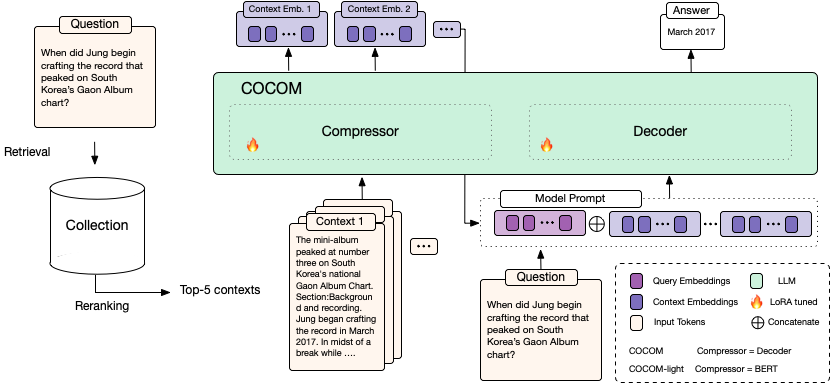

# Context Embeddings for Efficient Answer Generation in RAG


*Retrieval-Augmented Generation* (RAG) allows overcoming the limited knowledge of LLMs by extending the input with external context. A major drawback in RAG is the considerable increase in decoding time with longer inputs. We address this challenge by presenting **COCOM**, an effective context compression method, reducing long contexts to only a handful of *Context Embeddings* speeding up the generation time. Our method allows for different compression rates trading off decoding time for answer quality. Compared to earlier methods, COCOM allows for handling multiple contexts more effectively, significantly reducing decoding time for long inputs. Our method demonstrates a speed-up of up to 5.69 times while achieving higher performance compared to existing efficient context compression methods.



# Model Inference

For batch processing, the model takes as input 

- `questions` (`list`): A list containing questions
- `contexts` (`list of lists`). For each question a list of contexts, where the number of contexts is fixed throughout questions. The models have been fine-tuned (and should be inferenced) with `5` contexts.

The model compresses the questions into context embeddings and answers the question based on the provided context embeddings.

```python
from transformers import AutoModelForCausalLM

model = AutoModel.from_pretrained('cocom-v0-light-16-mistral-7b', trust_remote_code=True)
model = model.to('cuda')
contexts = [[
  'Rosalind Bailey. Rosalind Bailey Rosalind Bailey (born 1946) is a British actress, known for her portrayal of Sarah Headley ("née" Lytton) in the 1970s and 1980s BBC television drama “When the Boat Comes In". Bailey has appeared in numerous British television drama series, including "Byker Grove", “Distant Shores" and "Burn Up". Her stage work includes playing Miss Mary Shepherd in Alan Bennett’s play "The Lady in the Van”.',
  'Malcolm Terris. Malcolm Terris Malcolm Terris (born 11 January 1941 in Sunderland, County Durham) is a British actor. He had a lengthy career in a large number of television programmes. Possibly his best-known role was in "When the Boat Comes In", a popular 1970s series, where he played the part of Matt Headley. His film career includes appearances in "The First Great Train Robbery" (1978), "McVicar" (1980), "The Plague Dogs" (1982, voice only), "Slayground" (1983), “The Bounty" (1984) as Thomas Huggan, ship’s surgeon, "Mata Hari" (1985), "Revolution" (1985), “Scandal" (1989), and “Chaplin” (1992). His TV appearances include: One episode of',
  'When the Boat Comes In. When the Boat Comes In When the Boat Comes In is a British television period drama produced by the BBC between 1976 and 1981. The series stars James Bolam as Jack Ford, a First World War veteran who returns to his poverty-stricken (fictional) town of Gallowshield in the North East of England. The series dramatises the political struggles of the 1920s and 1930s and explores the impact of national and international politics upon Ford and the people around him. Section:Production. The majority of episodes were written by creator James Mitchell, but in Series 1 north-eastern',
  'Susie Youssef. Youssef began her comedy career as a writer for "The Ronnie Johns Half Hour" in 2006, and made her acting debut in the short film "Clicked" in the role of Lina in 2011. In 2014, she played Jane in the short film "Kevin Needs to Make New Friends: Because Everyone Hates Him for Some Reason" and then turned to television where she appeared in "The Chaser’s Media Circus". In 2014, Youssef played the lead role of Sarah in the Hayloft Project’s stage play "The Boat People" which won the Best On Stage award at the FBi SMAC Awards',
  'Madelaine Newton. Madelaine Newton Madelaine Newton is a British actress best known for her portrayal of Dolly in 1970s BBC television drama "When the Boat Comes In". She is married to actor Kevin Whately, known for his role as Robert "Robbie" Lewis in both "Inspector Morse” and its spin-off "Lewis". They have two children. She starred alongside her husband in the “Inspector Morse" episode "Masonic Mysteries" as Beryl Newsome - the love-interest of Morse - whom Morse was wrongly suspected of murdering. She played Whately’s on-screen wife in the 1988 Look and Read children’s serial, Geordie Racer. She also made'
  ]]
questions = ['who played sarah hedley in when the boat comes in?']

answers = model.generate_from_text(contexts=contexts, questions=questions, max_new_tokens=128)

print(answers)
```


 
## COCOM-light
To speed up intial decoding time a more lightweight compressor can be used:

```python
from cocom import COCOM
model = COCOM.from_pretrained('naver/cocom-light-16').eval()
```


## Checkpoints
| link | Decoder LLM  | Compressor | Compression rate | 
| -------- | ------- | ------- | ------- | 
|   [COCOM-128 🤗](https://huggingface.co/naver/cocom-128)   |   mistralai/Mistral-7B-Instruct-v0.2 | mistralai/Mistral-7B-Instruct-v0.2 | 128   |
 |   [COCOM-16 🤗](https://huggingface.co/naver/cocom-16)  |   mistralai/Mistral-7B-Instruct-v0.2 | mistralai/Mistral-7B-Instruct-v0.2 | 16   |
 |   [COCOM-4 🤗](https://huggingface.co/naver/cocom-4) |   mistralai/Mistral-7B-Instruct-v0.2 | mistralai/Mistral-7B-Instruct-v0.2 | 4    |
|   [COCOM-light-128 🤗](https://huggingface.co/naver/cocom-light-128)|   mistralai/Mistral-7B-Instruct-v0.2 | bert-base-uncased | 128      |
|   [COCOM-light-16 🤗](https://huggingface.co/naver/cocom-light-16)  |   mistralai/Mistral-7B-Instruct-v0.2 | bert-base-uncased | 16    |
|   [COCOM-light-4 🤗](https://huggingface.co/naver/cocom-light-4)  |   mistralai/Mistral-7B-Instruct-v0.2 | bert-base-uncased | 4    |


# Pre-training
We use `accelerate` for mult-gpu training using `Python 3.10`. Please make sure you have the following dependencies installed. 

```
torch
transformers
flash-attn --no-build-isolation
accelerate
rouge
datasets
wandb
```

You can do this with by running: 
```bash
pip3 install -r requirements.txt
```

# Fine-tuning

Coming soon...
### COCOM 
To train the `COCOM` model based on `Mistral-7B-Instruct-v0.2 ` with compression rate `128`. We used 8x A100 80GB for pre-training.

```bash
accelerate launch --multi_gpu --mixed_precision=bf16 --main_process_port 29002 pretraining.py \
  --dataset_name_or_dir "wshuai190/kilt-128" \
  --compression_rate 16 \
  --per_device_batch_size 16 \
  --gradient_accumulation 2 \
  --decoder_model_name "mistralai/Mistral-7B-Instruct-v0.2" \
  --lora 'True' \
  --tc_ratio 0.5 \
  --lr 1e-4 \
  --num_save_steps 10 \
  --experiment_folder "cocom_mistral_v2_pretrained" \
  --training_form 'both'
```

### COCOM-light 
To train the lightweight compressor with `Mistral-7B-Instruct-v0.2` as a decoder and `BERT` as a compressor with compression rate `128`:

```bash
accelerate launch --multi_gpu --mixed_precision=bf16 --main_process_port 29002 pretraining.py \
  --dataset_name_or_dir "wshuai190/kilt-128" \
  --compression_rate 16 \
  --per_device_batch_size 32 \
  --gradient_accumulation 1 \
  --decoder_model_name "mistralai/Mistral-7B-Instruct-v0.2" \
  --lora 'True' \
  --tc_ratio 0.5 \
  --lr 1e-4 \
  --compressor_model_name "google-bert/bert-base-uncased" \
  --num_save_steps 10 \
  --compression_linear_type 'concat' \
  --experiment_folder "cocom-light_mistral_v2_pretrained_bert" \
  --training_form 'both'
```


## Freeze Decoder 

For our ablation to understand the effect of freezing the decoder LLM use the argument `--training_form "compressor"`


# Measuring Efficiency

To benchmark efficiency run on a single GPU (We tested on 1x A100 80GB).

## Benchmarking Generation Efficiency: 
```bash
python3 efficiency_analysis.py --decoder_model_name mistralai/Mistral-7B-Instruct-v0.2 --test_mode generation
```

## Benchmarking Encoding Efficiency:
### COCOM-light:

```bash
python3 efficiency_analysis.py --decoder_model_name mistralai/Mistral-7B-Instruct-v0.2 --compressor_model_name google-bert/bert-base-uncased --test_mode compression --compression_rate 16
```

### COCOM:

```bash
python3 efficiency_analysis.py --decoder_model_name mistralai/Mistral-7B-Instruct-v0.2 --test_mode compression --compression_rate 16
```

